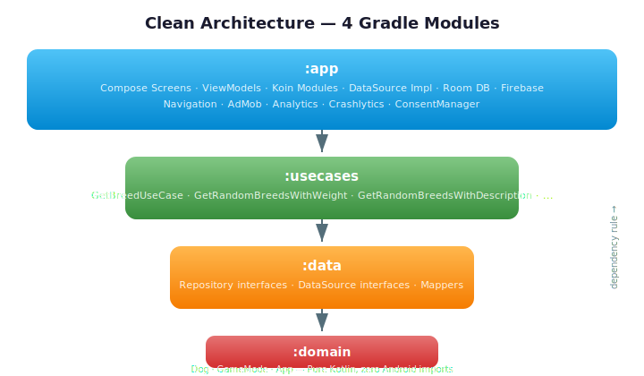
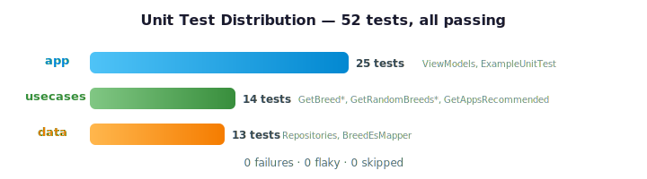

# AdivinaRaza

[](https://github.com/AlvaroQ/AdivinaRaza/actions/workflows/ci.yml)
[](https://play.google.com/store/apps/details?id=com.alvaroquintana.adivinaperro)


[](LICENSE)

---

## Table of Contents

[About](#about) · [Screenshots](#screenshots) · [Game Modes](#game-modes) · [Tech Stack](#tech-stack) · [Architecture](#architecture) · [Features](#features) · [Design Decisions](#design-decisions) · [Testing](#testing) · [Getting Started](#getting-started) · [Links](#links) · [License](#license)

---

## About

AdivinaRaza is an Android quiz game about **dog breeds** — their appearance, weight, height, descriptions, FCI classification and care needs. It offers four game modes, a catalogue of 200+ breeds with detailed information (nutrition, hygiene, common diseases, fun facts) and a progression system — built with modern Kotlin, Jetpack Compose and Clean Architecture.

It is also a long-lived production codebase that doubles as a real-world reference for modular Android architecture, Koin dependency injection, Firebase-backed data sync and an offline-first data layer powered by Room.

---

## Screenshots

<table align="center">
  <tr>
    <td align="center"><br/><sub>Breed quiz in play</sub></td>
    <td align="center"><br/><sub>Breed catalogue</sub></td>
    <td align="center"><br/><sub>Breed detail & care info</sub></td>
  </tr>
</table>

---

## Game Modes

| Mode                       | What you guess                                              |
| -------------------------- | ----------------------------------------------------------- |
| **Classic**                | Dog breed from its photo                                    |
| **Bigger or Smaller**      | Which breed is heavier or taller between two options        |
| **Guess by Description**   | Dog breed from a text description of its traits             |
| **FCI Trivia**             | FCI group classification for a given breed                  |

---

## Tech Stack

| Category               | Technology                                                      | Version           |
| ---------------------- | --------------------------------------------------------------- | ----------------- |
| Language               | Kotlin                                                          | 2.3.20            |
| Build                  | Android Gradle Plugin                                           | 9.1.1             |
| UI                     | Jetpack Compose + Material3                                     | BOM 2026.03.01    |
| Architecture           | Clean Architecture — 4 Gradle modules                           | MVVM              |
| State Management       | StateFlow + SharedFlow                                          | Coroutines 1.10.2 |
| Navigation             | Navigation Compose (type-safe, kotlinx.serialization)           | 2.9.7             |
| Dependency Injection   | Koin (Android + Compose)                                        | 4.2.1             |
| Local Persistence      | Room (KSP)                                                      | 2.8.4             |
| Backend                | Firebase (Firestore, Realtime DB, Auth, Analytics, Crashlytics) | BOM 34.12.0       |
| Images                 | Coil Compose (+ OkHttp network)                                 | 3.4.0             |
| Serialization          | kotlinx.serialization                                           | 1.11.0            |
| Monetization           | AdMob (banner + rewarded + interstitial) with UMP consent       | 25.2.0 / 4.0.0   |
| Code Quality           | Detekt                                                          | 1.23.8            |
| Min SDK                | Android 6.0 (Marshmallow)                                       | API 23            |
| Compile / Target SDK   | Android 15                                                      | API 36            |

---

## Architecture

<p align="center">
  
</p>

Four Gradle modules, one responsibility each:

- **`app`** — Android layer: Compose screens, ViewModels, Koin modules, DataSource implementations (Room, Firebase), notification scheduling, AdMob integration.
- **`usecases`** — Pure-JVM orchestration (`GetBreedUseCase`, `GetRandomBreedsWithWeight`, `GetRandomBreedsWithDescription`, `GetRandomBreedsWithFciGroup`...).
- **`data`** — Repository and DataSource **interfaces**. No implementations — those live in `app` so the Android SDK stays out of `data`.
- **`domain`** — Pure Kotlin entities: `Dog`, `GameMode`, `App`. Zero Android imports.

The dependency rule is enforced by the Gradle graph itself: if `domain` tried to import anything Android, Gradle wouldn't compile it. ViewModels expose `StateFlow` for reactive state and `SharedFlow` for one-shot events. Koin wires everything at application start.

---

## Features

- **Gameplay** — 4 game modes (classic breed quiz, weight/height comparison, description guessing, FCI trivia), lives system, stage progression, streak tracking.
- **Breed catalogue** — 200+ breeds with detailed info: origin, temperament, size category, coat type, exercise needs, grooming needs, trainability, barking level, fun facts.
- **Enriched data** — FCI group/section classification, nutrition guides, hygiene tips, common diseases, hair loss ratings, alternative names — sourced per breed in Spanish.
- **Platform** — Material3 light/dark themes, Coil image loading, AdMob (banner + rewarded + interstitial) with UMP consent, Firebase Analytics and Crashlytics.

---

## Design Decisions

Short rationale behind the less-obvious architectural choices — what was gained, what was given up.

- **Room as source of truth, Firebase as the seed.** Breed data syncs once from Firebase Realtime Database into Room; every subsequent query hits SQLite. Fully playable offline, predictable latency, and random-draw queries don't burn Firestore reads. *Tradeoff:* new content isn't real-time — acceptable for a dataset that changes on the order of weeks.
- **MVVM over MVI.** ViewModels expose granular `StateFlow`s per field plus a `SharedFlow` for one-shot events, instead of a single `UiState` reduced from `Intent`s. Screens here have a handful of orthogonal fields and no need for time-travel debugging, so MVI's reducer ceremony would be pure overhead. *Tradeoff:* no single snapshot of "the screen right now" — acceptable because state coherence is local to each ViewModel.
- **Koin over Hilt.** No `kapt`/`ksp` in the DI path means shorter incremental builds, and the composable-friendly API reaches into the UI layer without annotation processing. *Tradeoff:* runtime graph resolution — missing bindings crash on first use instead of a compile error. A disciplined `di.kt` module keeps the exposure bounded.
- **Destructive Room migration.** `fallbackToDestructiveMigration()` simplifies development — no migration scripts to maintain for a local cache that can always be re-seeded from Firebase. *Tradeoff:* a schema change wipes the local database, triggering a full re-sync on next launch.
- **DataSource implementations in `app`.** Keeps Android SDK (Room, Firebase) out of `data` and `domain` modules without introducing a fifth `:framework` module. For the current project size this is pragmatic. *Tradeoff:* `app` carries both presentation and infrastructure — worth splitting if the project grows significantly.

---

## Testing

<p align="center">
  
</p>

All tests run on the JVM — no device, no emulator. Every push and pull request to `main` runs the full suite through [GitHub Actions](.github/workflows/ci.yml).

| Module     | Tests | What's covered                                                                     |
| ---------- | ----- | ---------------------------------------------------------------------------------- |
| `app`      | 25    | ViewModels (`GameViewModel`, `BiggerSmallerViewModel`, `DescriptionViewModel`, `FciTriviaViewModel`, `InfoViewModel`, `ResultViewModel`) |
| `usecases` | 14    | `GetBreedById`, `GetBreedList`, `GetRandomBreedsWithWeight`, `GetRandomBreedsWithDescription`, `GetRandomBreedsWithFciGroup`, `GetRandomBreedsWithCare`, `GetAppsRecommended` |
| `data`     | 13    | `BreedByIdRepository`, `AppsRecommendedRepository`, `BreedEsMapper`                |
| **Total**  | **52** | **0 failures · 0 flaky · 0 skipped**                                              |

Stack:

- **JUnit 4** for the test harness
- **MockK 1.14.9** for mocking coroutine APIs and Firebase boundaries
- **Turbine 1.2.1** for asserting `Flow` emissions
- **kotlinx.coroutines.test** for `runTest` and `TestDispatcher`

Run the full suite locally:

```bash
./gradlew test
```

Run a single module:

```bash
./gradlew :domain:test
./gradlew :usecases:test
```

---

## Getting Started

### Prerequisites

- **JDK 17+** (required by Android Gradle Plugin 9.x)
- **Android Studio Ladybug (2024.2)** or newer
- **Android SDK 36** installed via SDK Manager
- A Firebase project with `google-services.json` (Firestore, Realtime Database, Auth, Analytics and Crashlytics enabled)
- An AdMob account for ad unit IDs (test IDs work out of the box for debug builds)

### Setup

1. Clone the repository:

   ```bash
   git clone https://github.com/AlvaroQ/AdivinaRaza.git
   ```

2. Drop your `google-services.json` in `app/`.

3. Create `app/secrets/secrets.xml` with your AdMob keys:

   ```xml
   <?xml version="1.0" encoding="utf-8"?>
   <resources>
       <string name="admob_id">ca-app-pub-XXXXXXXXXXXXXXXX~XXXXXXXXXX</string>
       <string name="admob_banner_test_id">ca-app-pub-XXXXXXXXXXXXXXXX/XXXXXXXXXX</string>
       <string name="admob_bonificado_test_id">ca-app-pub-XXXXXXXXXXXXXXXX/XXXXXXXXXX</string>
       <string name="admob_banner_game">ca-app-pub-XXXXXXXXXXXXXXXX/XXXXXXXXXX</string>
       <string name="admob_banner_info">ca-app-pub-XXXXXXXXXXXXXXXX/XXXXXXXXXX</string>
       <string name="admob_bonificado_game">ca-app-pub-XXXXXXXXXXXXXXXX/XXXXXXXXXX</string>
       <string name="admob_bonificado_game_over">ca-app-pub-XXXXXXXXXXXXXXXX/XXXXXXXXXX</string>
       <string name="admob_intersticial">ca-app-pub-XXXXXXXXXXXXXXXX/XXXXXXXXXX</string>
   </resources>
   ```

   For a first build, Google publishes a set of always-on [AdMob test ad unit IDs](https://developers.google.com/admob/android/test-ads) that you can drop into the `*_test_id` entries. Replace them with your own production IDs before shipping a release build.

4. Build the debug APK:

   ```bash
   ./gradlew assembleDebug
   ```

5. (Optional) Run the unit tests:

   ```bash
   ./gradlew test
   ```

---

## Links

- [Play Store listing](https://play.google.com/store/apps/details?id=com.alvaroquintana.adivinaperro) — install AdivinaRaza on your device
- [Report a bug](https://github.com/AlvaroQ/AdivinaRaza/issues/new?labels=bug) — something broken or unexpected
- [Request a feature](https://github.com/AlvaroQ/AdivinaRaza/issues/new?labels=enhancement) — propose an improvement
- [CI workflows](https://github.com/AlvaroQ/AdivinaRaza/actions) — latest build and test runs

---

## License

Released under the [Apache License 2.0](LICENSE). You are free to use, modify, and distribute the code with attribution.
